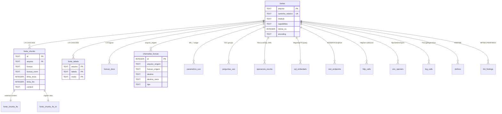

# plugadvpl — Schema SQLite

Este documento descreve o schema do `.plugadvpl/index.db` na versão MVP v0.1.0. O schema é **baseado** em projeto interno anterior do autor (validado em ampla base de fontes ADVPL) + deltas necessários para uso como plugin local Claude Code.

## Visão geral

```
v0.1.0 schema (migration 001_initial.sql):
  - 22 tabelas físicas (Universo 1 — Fontes)
  - 2 FTS5 virtuais (dual-index strategy)
  - 6 lookups pré-populadas (525+ rows total)
  - 1 tabela auxiliar normalizada (fonte_tabela)
  - 2 tabelas internas (meta, ingest_progress, _migrations)
```

**Reservado para v0.2+** (via migrations 002+):

- Universo 2: Dicionário SX (SX1, SX3, SXE, SX6, ...)
- Universo 3: Rastreabilidade cross-fonte e análise de impacto

---

## ER overview



Resumo textual:

```
                            +----------------+
                            |     fontes     | (PRIMARY KEY: arquivo)
                            +----------------+
                                    ^
                            FK CASCADE ON DELETE
                |-------------------|-------------------|
                |                   |                   |
        +---------------+   +---------------+   +---------------+
        | fonte_chunks  |   | fonte_tabela  |   |  funcao_docs  |
        +---------------+   +---------------+   +---------------+
                |
                | (content='fonte_chunks', content_rowid='rowid')
                v
        +---------------------+
        |  fonte_chunks_fts   | (FTS5 - unicode61 + tokenchars '_-')
        | fonte_chunks_fts_tri| (FTS5 - trigram para substring exata)
        +---------------------+

  Tabelas-satelite (FK logica via arquivo, sem CASCADE):
    chamadas_funcao, parametros_uso, perguntas_uso, operacoes_escrita,
    sql_embedado, rest_endpoints, http_calls, env_openers, log_calls,
    defines, lint_findings

  Lookups embarcadas (WITHOUT ROWID, pre-populadas no init):
    funcoes_nativas, funcoes_restritas, lint_rules,
    sql_macros, modulos_erp, pontos_entrada_padrao

  Internas:
    meta, ingest_progress, _migrations
```

---

## Universo 1 — Fontes (8 tabelas)

### `fontes`

Linha por arquivo `.prw`/`.tlpp`/`.prx`/`.apw` indexado.

| Coluna | Tipo | Origem | Notas |
|---|---|---|---|
| `arquivo` | TEXT PK | basename | "FATA050.prw" |
| `caminho` | TEXT | FS path original | "D:/Projeto/src/.../FATA050.prw" |
| `caminho_relativo` | TEXT UNIQUE | normalizado | lowercase, forward slashes, relativo ao `--root` |
| `tipo` | TEXT | parser | "custom" \| "padrao" |
| `modulo` | TEXT | parser | "FAT", "CTB", "EST", ... |
| `funcoes` | TEXT (JSON) | parser | lista de top-level functions |
| `user_funcs` | TEXT (JSON) | parser | lista de `User Function` |
| `pontos_entrada` | TEXT (JSON) | parser | PEs detectados (cruzar com `pontos_entrada_padrao`) |
| `tabelas_ref` | TEXT (JSON) | parser | tabelas lidas |
| `write_tables` | TEXT (JSON) | parser | tabelas escritas (RecLock+Replace, Tcsqlexec INSERT/UPDATE/DELETE) |
| `reclock_tables` | TEXT (JSON) | parser | apenas RecLock (subset de write) |
| `includes` | TEXT (JSON) | parser | .ch usados |
| `calls_u` | TEXT (JSON) | parser | chamadas a `U_xxx` (custom functions) |
| `calls_execblock` | TEXT (JSON) | parser | ExecBlock("FUNC", ...) calls |
| `fields_ref` | TEXT (JSON) | parser | campos referenciados (SA1->A1_COD) |
| `lines_of_code` | INTEGER | scanner | total lines |
| `hash` | TEXT | scanner | SHA-256 do conteúdo |
| `source_type` | TEXT | parser | "rotina" \| "fonte_classe" \| "wsservice" \| "include" \| ... |
| `capabilities` | TEXT (JSON) | parser | ["mvc", "rest", "job", "pe", "sx_dict"] |
| `ws_structures` | TEXT (JSON) | parser | WSCLIENT/WSDATA hierarquia |
| `encoding` | TEXT | scanner | "cp1252" \| "utf-8" |
| `mtime_ns` | INTEGER | scanner | mtime do FS em nanoseconds (delta plugin) |
| `size_bytes` | INTEGER | scanner | tamanho em bytes (delta plugin) |
| `indexed_at` | TEXT | DEFAULT now() | timestamp da última ingestão |
| `namespace` | TEXT | parser | TLPP namespace (vazio para PRW) |
| `tipo_arquivo` | TEXT | scanner | "prw" \| "tlpp" \| "prx" \| "apw" \| ... |
| `parser_version` | TEXT | ingester | versão do parser usado nesta ingestão |

**Índices:** `idx_fontes_modulo`, `idx_fontes_source_type`, `idx_fontes_caminho_rel`.

---

### `fonte_chunks`

Linha por **função** (ou método/PE/header) extraída. ID composto: `<arquivo>::<funcao>`.

| Coluna | Tipo | Notas |
|---|---|---|
| `id` | TEXT PK | `"FATA050.prw::FATA050"` |
| `arquivo` | TEXT FK → fontes.arquivo | ON DELETE CASCADE |
| `funcao` | TEXT | nome original (case preserved) |
| `funcao_norm` | TEXT | uppercase + trim (case-insensitive lookup) |
| `tipo_simbolo` | TEXT | function \| static_function \| user_function \| main_function \| method \| ws_method \| mvc_hook \| class \| header |
| `classe` | TEXT | preenchido se `METHOD ... CLASS X` |
| `linha_inicio` / `linha_fim` | INTEGER | range no arquivo |
| `assinatura` | TEXT | linha do header (parametros, return) |
| `content` | TEXT | corpo (pode ser NULL se `ingest --no-content`) |
| `modulo` | TEXT | herdado de `fontes.modulo` |

**Índices:** `idx_chunks_arquivo`, `idx_chunks_funcao` (NOCASE), `idx_chunks_funcao_norm`, `idx_chunks_tipo`.

---

### `chamadas_funcao`

Edges do call graph. Uma row por call site.

| Coluna | Notas |
|---|---|
| `arquivo_origem` + `funcao_origem` + `linha_origem` | onde a chamada acontece |
| `tipo` | "U_" \| "static" \| "method" \| "execblock" \| "wsmethod" |
| `destino` | nome original chamado |
| `destino_norm` | uppercase + sem prefixo `U_` (lookup case-insensitive) |
| `arquivo_destino` / `funcao_destino` | resolved post-ingest (NULL se externo) |
| `contexto` | snippet curto |

**Índices:** `idx_cf_origem`, `idx_cf_destino` (NOCASE), `idx_cf_destino_norm`.

---

### `parametros_uso`

Uso de parâmetros MV_* via GetMV/SuperGetMV/PutMV.

| Coluna | Notas |
|---|---|
| `arquivo` | source |
| `parametro` | "MV_LOCALIZA" |
| `modo` | "read" \| "write" \| "read_write" |
| `default_decl` | default declarado |

**Índices:** `idx_pu_param`, `idx_pu_arquivo`.

---

### `perguntas_uso`

Grupos de perguntas SX1 referenciados (Pergunte/SXBuscaPerg).

| Coluna | Notas |
|---|---|
| `arquivo`, `grupo` | "FAT050", "CTB100", ... |

---

### `operacoes_escrita`

Operações de escrita em tabelas (RecLock+Replace, MsExecAuto INSERT, TCSqlExec mutativo).

| Coluna | Notas |
|---|---|
| `arquivo` + `funcao` | onde |
| `tipo` | "reclock_replace" \| "msexecauto" \| "sql_insert" \| "sql_update" \| "sql_delete" |
| `tabela` | nome da tabela (3 chars + filial) |
| `campos` | JSON list |
| `origens` | JSON map {campo: origem (literal/var)} |
| `condicao` | snippet do WHERE |

---

### `sql_embedado`

SQL nativo dentro do .prw (BeginSql/EndSql, TCSqlExec/TCQuery).

| Coluna | Notas |
|---|---|
| `arquivo`, `funcao`, `linha` | onde |
| `operacao` | "select" \| "insert" \| "update" \| "delete" |
| `tabelas` | JSON list (com macros `%xfilial%`, `%table:SX1%` resolvidas) |
| `snippet` | primeiras N chars |

---

### `funcao_docs`

Docstrings/comentários estruturados extraídos de cabeçalhos de função.

| Coluna | Notas |
|---|---|
| `arquivo` + `funcao` | PK composta |
| `tipo`, `assinatura`, `resumo`, `params`, `retorno` | extraídos |
| `tabelas_ref`, `campos_ref`, `chama`, `chamada_por` | listas extraídas do header |
| `fonte` | "auto" (extracted) vs "manual" |
| `resumo_auto` | gerado se header não tem comentário (v0.2+) |

---

## Nível 2 — Extrações novas (5 tabelas)

Extrações novas (não estavam no baseline interno), valiosas para análise moderna.

### `rest_endpoints`

WSSERVICE + WSMETHOD GET/POST + TLPP `@Get/@Post/@Put/@Delete`.

| Coluna | Notas |
|---|---|
| `arquivo`, `classe`, `funcao`, `verbo`, `path` | endpoint info |
| `annotation_style` | "wsmethod_classico" \| "@verb_tlpp" |

**Índices:** `idx_rest_verb`, `idx_rest_path`.

### `http_calls`

Chamadas HTTP outbound (HttpGet/HttpPost/HttpsPost/MsAGetUrl).

### `env_openers`

`RpcSetType` + `RpcSetEnv` + `OpenEnv` — pontos de entrada em jobs e processos batch.

### `log_calls`

`FwLogMsg` + `conout` para mapeamento de telemetria.

### `defines`

Macros `#DEFINE NOME VALOR` para resolução de identifiers em queries.

---

## Nível 3 — Lint (1 tabela)

### `lint_findings`

| Coluna | Notas |
|---|---|
| `arquivo` + `funcao` + `linha` | localização |
| `regra_id` | FK lógica → `lint_rules.regra_id` (BP-001, SEC-002, ...) |
| `severidade` | "critical" \| "error" \| "warning" |
| `snippet` | linha exata |
| `sugestao_fix` | herdado de `lint_rules.fix_guidance` |

**Índices:** `idx_lint_arquivo`, `idx_lint_regra`, `idx_lint_sev`.

---

## Tabela auxiliar normalizada

### `fonte_tabela`

`(arquivo, tabela, modo)` denormalizado para lookup reverso O(log N). Sem essa tabela, `plugadvpl tables SA1` precisaria fazer full-scan em `fontes.tabelas_ref` (JSON).

| Coluna | Notas |
|---|---|
| `arquivo` | FK → fontes.arquivo CASCADE |
| `tabela` | "SA1" (uppercase) |
| `modo` | "read" \| "write" \| "reclock" |

PRIMARY KEY composta `(arquivo, tabela, modo)`, WITHOUT ROWID.
Índice: `idx_ft_tabela (tabela NOCASE, modo)`.

---

## Lookups embarcadas (6 tabelas)

Todas `WITHOUT ROWID`, populadas no `init` a partir de `cli/plugadvpl/lookups/*.json`. Esses dados foram **extraídos do projeto [advpl-specialist](https://github.com/thalysjuvenal/advpl-specialist)** (Thalys Augusto, MIT) via `scripts/extract_lookups.py` — crédito completo em [NOTICE](../NOTICE).

| Tabela | Rows | Conteúdo |
|---|---|---|
| `funcoes_nativas` | 279 | Funções nativas do TOTVS Protheus com categoria, assinatura, params_count, requer_unlock, requer_close_area, deprecated, alternativa |
| `funcoes_restritas` | 194 | Funções bloqueadas/proibidas com data de bloqueio e alternativa recomendada |
| `lint_rules` | 24 | Regras de lint catalogadas (BP-*, SEC-*, PERF-*, MOD-*) com severidade, descrição, fix_guidance |
| `sql_macros` | 5 | Macros TOTVS SQL: `%xfilial%`, `%table:XXX%`, `%notdel%`, etc. — descrição + safe_for_injection flag |
| `modulos_erp` | 8 | Módulos ERP Protheus (FAT, CTB, EST, FIN, COM, GPE, ...) com prefixos de tabelas/funções típicos |
| `pontos_entrada_padrao` | 15 | PEs catalogados (M460FIM, MT100GRV, MA040FIM, ...) com paramixb_count, retorno_tipo, link_tdn |

---

## Internas (3 tabelas)

### `meta`

Key-value store para metadados do índice.

```
schema_version    -> "001"
cli_version       -> "0.1.0"
parser_version    -> "p1.0.0"
project_root      -> "/caminho/do/projeto"
ingested_at       -> "2026-05-11T13:00:00Z"
```

### `ingest_progress`

Tracking de progresso por arquivo (status: pending\|ingesting\|done\|failed). Usado pelo runner paralelo para recuperar de crash.

### `_migrations`

Tracking de migrations aplicadas. `WITHOUT ROWID`.

```
filename         | applied_at
-----------------+--------------------
001_initial.sql  | 2026-05-11 13:00:00
```

A função `apply_migrations(conn)` lê os `.sql` files em `cli/plugadvpl/migrations/` em ordem alfabética, pula os já registrados em `_migrations`, executa o resto em transações separadas. Idempotente.

---

## FTS5 dual-index strategy

Duas tabelas virtuais FTS5 sobre o mesmo "external content" (`fonte_chunks.content`, indexado por `rowid`):

### `fonte_chunks_fts` — Índice A (unicode61 com tokenchars)

```sql
USING fts5(
    arquivo, funcao, content,
    content='fonte_chunks',
    content_rowid='rowid',
    tokenize = "unicode61 remove_diacritics 2 tokenchars '_-'"
)
```

**Para que serve:** busca por palavras inteiras e identifiers ADVPL com underscore/hífen.

- `tokenchars '_-'` faz `A1_COD` e `FW-Browse` serem **um único token** (sem o flag, FTS5 quebra em `A1` + `COD`).
- `remove_diacritics 2` ajuda em comentários em português.

**Uso típico:** `plugadvpl grep MaCnt` ou `plugadvpl find termo`.

### `fonte_chunks_fts_tri` — Índice B (trigram)

```sql
USING fts5(
    content,
    content='fonte_chunks',
    content_rowid='rowid',
    tokenize = 'trigram'
)
```

**Para que serve:** substring exata com pontuação ADVPL.

- `SA1->A1_COD` (operador `->`) não é tokenizável pelo Índice A.
- `%xfilial%` (macros SQL com `%`) idem.
- `::New`, `PARAMIXB[1]`, `oModel:Activate()` idem.

Trigram (disponível desde SQLite 3.34) indexa qualquer substring de 3+ chars. Custa mais espaço, mas é a única forma de pesquisar pontuação literal sem fallback a LIKE.

**Uso típico:** `plugadvpl grep "SA1->A1_COD" --mode literal`.

### Sincronização

O ingest não usa triggers automáticos — em vez disso, faz `INSERT INTO fonte_chunks_fts(fonte_chunks_fts) VALUES('rebuild')` ao final de cada ingest/reindex. Trade-off: simplicidade e performance de bulk ingest vs latência de rebuild (~2s para 11k chunks).

---

## Padrões de PRAGMA

Os PRAGMAs init-time são aplicados programaticamente em `open_db()`, NÃO no SQL da migration (porque `page_size` só vale em DB vazio e `journal_mode` depende de detecção de network share):

```python
PRAGMA page_size = 8192;               # Optimal para text-heavy workloads
PRAGMA journal_mode = WAL;             # WAL em local; DELETE em network share
PRAGMA journal_size_limit = 67108864;  # 64 MiB
PRAGMA synchronous = NORMAL;           # WAL + NORMAL = boa durabilidade
PRAGMA temp_store = MEMORY;
PRAGMA cache_size = -64000;            # 64 MiB cache
PRAGMA foreign_keys = ON;
```

A detecção de WAL-incompatibilidade (network drives, SMB) é feita no momento de abrir o DB — se detectar, faz fallback a `journal_mode=DELETE`.

---

## PO UI (migrations 022–023)

### `poui_projetos` (migration 022)

1 row por `package.json` com dependência `@po-ui/*`. Populada por `plugadvpl ingest-poui`.

| Coluna | Tipo | Descrição |
|---|---|---|
| `caminho` | TEXT UNIQUE | Path absoluto do `package.json` |
| `poui_version` | TEXT | Versão exata de `@po-ui/ng-components` (ou primeiro pacote) |
| `poui_major` | INTEGER | Major extraído da versão (`^21.18.0` → 21) |
| `angular_version` | TEXT | Range de `@angular/core` (`^21.0.3`) |
| `angular_major` | INTEGER | Major do Angular exigido |
| `compativel` | INTEGER | 1 se `poui_major == angular_major` (ou um deles é null); 0 se incompatível |
| `pacotes_json` | TEXT | JSON array dos pacotes `@po-ui/*` encontrados |
| `hash` | TEXT | SHA-256 do `package.json` (cache de re-ingestão) |
| `mtime_ns` | INTEGER | mtime em nanosegundos (cache de re-ingestão) |

Índice: `idx_poui_compat` em `compativel` (consulta rápida de incompatíveis).

### `poui_datasources` (migration 023)

1 row por chamada `HttpClient` encontrada nos `.ts` de um projeto PO UI. Populada por
`plugadvpl ingest-poui` (Fase 2). Cruzada com `rest_endpoints` via `plugadvpl poui-bridge`.

| Coluna | Tipo | Descrição |
|---|---|---|
| `caminho` | TEXT | Path absoluto do arquivo `.ts` onde a chamada está |
| `linha` | INTEGER | Número da linha da chamada |
| `verbo` | TEXT | Verbo HTTP: `GET`, `POST`, `PUT`, `DELETE`, `PATCH` |
| `url_raw` | TEXT | URL literal/template capturada |
| `path_norm` | TEXT | Path estático normalizado casável com `rest_endpoints.path` |

Índice: `idx_poui_ds_path` em `path_norm` (JOIN com `rest_endpoints`).

### `poui_componentes` (migration 024)

Catálogo de bindings `p-*` (inputs e outputs) por componente Angular do
`po-angular`. Populada por `seed_lookups` via `lookups/poui_componentes.json`
(948 entradas). Usada pelo comando `plugadvpl poui-componentes` para consulta
rápida de quais atributos um componente aceita.

| Coluna | Tipo | Descrição |
|---|---|---|
| `chave` | TEXT PK | PK sintética: `{componente}:{kind}:{binding}` |
| `componente` | TEXT | Nome do componente Angular (ex: `po-table`) |
| `kind` | TEXT | `input` ou `output` |
| `binding` | TEXT | Atributo HTML `p-*` (ex: `p-columns`) |
| `propriedade` | TEXT | Nome da propriedade TypeScript (ex: `columns`) |
| `fonte` | TEXT | Arquivo `.ts` de origem no repositório `po-angular` |

Índice: `idx_poui_componentes_comp` em `componente`.

### `poui_componentes_uso` (migration 025)

Registra uso de componentes `<po-*>` + bindings `p-*` encontrados nos templates
HTML do projeto. Populada por `plugadvpl ingest-poui` (Fase 3b). Cruzada com
`poui_componentes` pela query `poui_lint` para detectar bindings inexistentes
(regra `POUI-PROP`).

| Coluna | Tipo | Descrição |
|---|---|---|
| `id` | INTEGER PK | Chave primária autoincrement |
| `caminho` | TEXT | Caminho absoluto do arquivo `.html` |
| `linha` | INTEGER | Linha onde o componente aparece no template |
| `componente` | TEXT | Nome do componente Angular (ex: `po-button`) |
| `binding` | TEXT | Atributo `p-*` usado (ex: `p-label`) |
| `kind` | TEXT | `input` ou `output` |

Índice: `idx_poui_uso_comp` em `componente`.

### `fonte_header_doc` (migration 026)

Header doc declarativo extraído do topo de fontes ADVPL/TLPP (bloco
`Programa/Autor/Descrição` que muitos fontes Protheus trazem no cabeçalho),
distinto do Protheus.doc. Populada no `ingest` por `parsing/header.py` — só grava
quando reconhece o header (≥ 2 labels conhecidos); no-op gracioso quando ausente.
Exposta via `arch <fonte> --include-header`. Cobertura varia muito por convenção
do projeto (~0% a ~40% dos fontes).

| Coluna | Tipo | Descrição |
|---|---|---|
| `arquivo` | TEXT PK | Basename do fonte (== `fontes.arquivo`) |
| `programa` | TEXT | Nome declarado (pode diferir do arquivo) |
| `autor` | TEXT | Autor/analista |
| `data_criacao` | TEXT | String crua (formatos variados) |
| `descricao` | TEXT | Descrição/Objetivo |
| `doc_origem` | TEXT | Doc.Origem / GAP / Chamado |
| `solicitante` | TEXT | Solicitante/Cliente |
| `uso` | TEXT | Empresa/projeto onde roda |
| `observacao` | TEXT | Costuma conter histórico de versões |
| `raw_header` | TEXT | Bloco completo (fallback; omitido em `--no-content`) |

### `catalog_meta` / `catalog_data` (migration 027)

Dumps TSV/CSV de tabelas-catálogo (Z*/X*) importados via `ingest-tsv`, consultados por `catalog`. Modelo **row-JSON** (1 linha por registro, colunas em JSON) — schema arbitrário sem `ALTER TABLE` por dump; a agregação acontece em Python (dumps típicos ~N×k linhas).

`catalog_meta`:

| Coluna | Tipo | Descrição |
|---|---|---|
| `alias` | TEXT PK | Nome lógico do dump (`--as`) |
| `source_file` | TEXT | Caminho do arquivo importado |
| `sx_table` | TEXT | Tabela SX correlata (se o nome bate — habilita `--decode-cbox`) |
| `columns_json` | TEXT | Lista ordenada de colunas (JSON) |
| `row_count` | INTEGER | Nº de registros |
| `ingested_at` | TEXT | Timestamp ISO |
| `encoding` / `delimiter` | TEXT | Detectados na importação |

`catalog_data`: `(alias, row_id, row_json)` — PK `(alias, row_id)`, índice em `alias`. `row_json` = `{coluna: valor}`.

---

## Reservado para v0.2+

Schema futuro (não implementado na migration 001):

**Universo 2 — Dicionário SX**

- `sx1_perguntas` (grupos do Pergunte)
- `sx3_campos` (estrutura das tabelas: tipo, tamanho, validações)
- `sx6_parametros` (catálogo de MV_*)
- `sxe_sxf_sequencias` (sequenciadores)
- `sx2_tabelas` (catálogo geral)

**Universo 3 — Rastreabilidade cross-fonte**

- `impacto_funcao` (cruza chamadas + tabelas + PEs)
- `impacto_tabela` (todos os fontes que tocam uma tabela)
- `impacto_campo` (cruza com sx3_campos para análise field-level)

Detalhes em `docs/superpowers/specs/2026-05-11-plugadvpl-design.md` §11–§13.

---

## Queries úteis

Exemplos prontos para colar em `sqlite3 .plugadvpl/index.db` ou em scripts ad-hoc. Estes mesmos padrões alimentam internamente os subcomandos do CLI.

### Quem chama uma função (call graph reverso)

```sql
-- Equivalente a: plugadvpl callers MaFisRef
SELECT arquivo_origem, funcao_origem, linha_origem, tipo
FROM chamadas_funcao
WHERE destino_norm = UPPER('MaFisRef')
ORDER BY arquivo_origem, linha_origem;
```

### Quais fontes leem/gravam uma tabela

```sql
-- Equivalente a: plugadvpl tables SA1 --mode read
SELECT arquivo, modo
FROM fonte_tabela
WHERE tabela = 'SA1' COLLATE NOCASE
ORDER BY modo, arquivo;

-- Apenas RecLock (escrita posicionada — costuma indicar negócio crítico)
SELECT arquivo FROM fonte_tabela
WHERE tabela = 'SA1' AND modo = 'reclock';
```

### Top 10 funções mais chamadas

```sql
SELECT destino_norm AS funcao, COUNT(*) AS n_chamadas
FROM chamadas_funcao
GROUP BY destino_norm
ORDER BY n_chamadas DESC
LIMIT 10;
```

### Fontes com mais lint findings críticos

```sql
SELECT arquivo, COUNT(*) AS n_critical
FROM lint_findings
WHERE severidade = 'critical'
GROUP BY arquivo
ORDER BY n_critical DESC
LIMIT 20;
```

### REST endpoints expostos no projeto

```sql
SELECT arquivo, classe, funcao, verbo, path, annotation_style
FROM rest_endpoints
ORDER BY verbo, path;
```

### SQL embarcado com UPDATE/DELETE em tabela específica

```sql
SELECT arquivo, funcao, linha, operacao, snippet
FROM sql_embedado
WHERE operacao IN ('update','delete')
  AND tabelas LIKE '%"SC5"%'
ORDER BY arquivo, linha;
```

### Onde um parâmetro MV é lido

```sql
SELECT arquivo, modo, default_decl
FROM parametros_uso
WHERE parametro = 'MV_LOCALIZA'
ORDER BY arquivo;
```

### Cruzar findings com regra catalogada

```sql
SELECT lf.arquivo, lf.linha, lf.regra_id, lr.titulo, lr.severidade, lr.fix_guidance
FROM lint_findings lf
JOIN lint_rules lr USING (regra_id)
WHERE lf.severidade = 'critical'
ORDER BY lf.arquivo, lf.linha;
```

### FTS5 — busca textual ponderada

```sql
-- Índice lógico (tokens com '_' e '-')
SELECT arquivo, funcao, snippet(fonte_chunks_fts, 2, '«', '»', '…', 10) AS hit
FROM fonte_chunks_fts
WHERE fonte_chunks_fts MATCH 'MaFisRef OR FATA050'
ORDER BY rank
LIMIT 20;

-- Trigram (substring exata com pontuação ADVPL)
SELECT fc.arquivo, fc.funcao
FROM fonte_chunks_fts_tri t
JOIN fonte_chunks fc ON fc.rowid = t.rowid
WHERE t.content MATCH '"SA1->A1_COD"'
LIMIT 20;
```

### Sanity check do índice

```sql
-- Conferir versões e contadores (também via: plugadvpl status)
SELECT chave, valor FROM meta;

-- FTS sincronizado com fonte_chunks?
SELECT
  (SELECT COUNT(*) FROM fonte_chunks)            AS chunks,
  (SELECT COUNT(*) FROM fonte_chunks_fts)        AS fts_unicode,
  (SELECT COUNT(*) FROM fonte_chunks_fts_tri)    AS fts_trigram;

-- Órfãos (chamadas para arquivo que não foi ingestado)
SELECT DISTINCT arquivo_origem
FROM chamadas_funcao
WHERE arquivo_origem NOT IN (SELECT arquivo FROM fontes);
```
