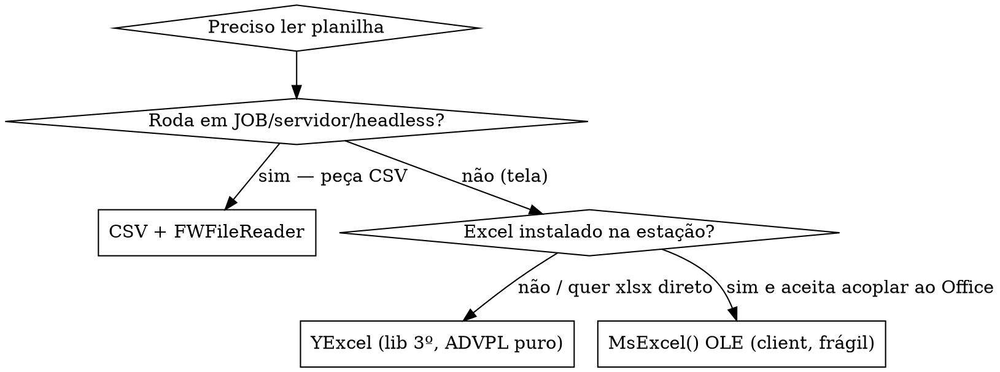

# advpl-excel — Excel (.xls/.xlsx/CSV) no Protheus

> ⛔ **FATO CENTRAL (TOTVS oficial): NÃO existe função nativa que LEIA arquivo `.xls`/`.xlsx` em ADVPL/TLPP.** Literal: *"Não existe função que leia o arquivo XLS e XLSX."* ([KB 360036111734](https://centraldeatendimento.totvs.com/hc/pt-br/articles/360036111734)). Quem afirma o contrário (ex.: `FWLerExcel`, `MsExcel():GetValue` nativo, `OleAuto`) está **alucinando**. Ler planilha = um dos 4 caminhos reais abaixo.

## ⚠️ Funções que NÃO existem (rejeite — são alucinação)

Nenhum destes existe no Protheus. Se aparecerem, é invenção:

| Nome falso | Realidade |
|---|---|
| `FWLerExcel()` / `LeExcel()` / `MsRetXls()` / `FWLoadXLS()` | ❌ não existe nenhuma função nativa de leitura |
| `FWImportExcel()` / `ExcelToArray()` / `MsReadExcel()` | ❌ não existe |
| `OleAuto():New("Excel.Application")` | ❌ idioma Harbour/xHarbour, **não** é ADVPL Protheus — a classe OLE do Protheus é `MsExcel` (interna) |
| `MSExcelEx():New()` / `:_oExcel` | ❌ confusão: existe `FWMsExcelEx` (escrita de XML), sem `_oExcel`, e não lê |
| `MsExcel():GetValue(lin,col)` pra ler do disco | ❌ `GetValue` é da lib de terceiro `YExcel`, não da `MsExcel` nativa |
| `AddCell()` em FWMsExcel* | ❌ a célula entra via `AddRow` (array); `AddCell` não é API pública |
| `FWBrowse:ToExcel()` | ❌ não existe; exporte via "Imprimir Browse" (acesso 188) ou monte FWMsExcel |

> Regra de ouro: antes de usar qualquer `*Excel*`, confirme no índice do projeto (`/plugadvpl:find function <nome>`). Se não estiver no dicionário nem nesta skill, trate como inexistente.

## LER planilha — escolha o caminho



| Caminho | Quando | API real | Cuidados |
|---|---|---|---|
| **CSV + `FWFileReader`** (recomendado) | server/job/headless; usuário salva como CSV | `FWFileReader():New(arq)` → `:Open()` / `:HasLine()` / `:GetLine()` / `:Close()` | separa colunas com `StrTokArr`/`Separa`. [TDN](https://tdn.totvs.com/display/framework/FWFileReader) |
| **CSV + `FT_F*`** (clássico) | idem, código legado | `FT_FUse(arq)`(-1=erro) → `FT_FGoTop()` → `FT_FReadLn()` → `FT_FSkip()` → `FT_FUse()`(fecha) | ⚠️ **máx. 1022 bytes/linha** |
| **XML + `TXmlManager`** | origem é XML SpreadsheetML | classe de parse XML | gere/extraia o XML primeiro |
| **`MsExcel()` via OLE** | tela, Excel 32-bit na estação | `MsExcel():New()` → `:WorkBooks:Open(arq)` → `:SetVisible(.T.)` → `:Destroy()` | **interno/sem suporte**; quebra em JOB e Office 64-bit (erros `Ap5_Excel_8`/"MsExcel não Instalado") |
| **`YExcel`** (terceiro, ADVPL puro) | ler `.xlsx` sem Excel | `YExcel():new(,arq)` → `:GetValue(l,c)` / `:LinTam()` / `:ColTam(l)` / `:LenPlanAt()` / `:SetPlanAt(n)` / `:Close()` | não-TOTVS ([saulogm/advpl-excel](https://github.com/saulogm/advpl-excel)); datas voltam objeto (`ValType "O"`) |

### Esqueleto: ler CSV → gravar em tabela (o caso do leitor)

```advpl
#include "totvs.ch"

User Function ZImpCli()
    Local cArq    := cGetFile("Arquivo CSV|*.csv", "Selecione o CSV")
    Local oReader  // FWFileReader
    Local aCols    := {}
    Local nLin     := 0

    If Empty(cArq)
        Return Nil
    EndIf

    oReader := FWFileReader():New(cArq)
    If !oReader:Open()
        Help(, , "ZImpCli", , "Não foi possível abrir " + cArq, 1, 0)
        Return Nil
    EndIf

    Begin Transaction
        While oReader:HasLine()
            nLin++
            // StrTran(...Chr(13)...) tira o CR de arquivos CRLF — senão a ÚLTIMA
            // coluna vem com "\r" no fim e quebra parse (ex: booleano sempre .F.).
            aCols := StrTokArr(StrTran(oReader:GetLine(), Chr(13), ""), ";")   // ; = separador BR
            If nLin == 1 .Or. Len(aCols) < 2              // pula cabeçalho / linha curta
                Loop
            EndIf
            RecLock("ZZ0", .T.)
                ZZ0->ZZ0_FILIAL := xFilial("ZZ0")
                ZZ0->ZZ0_COD    := PadR(AllTrim(aCols[1]), TamSX3("ZZ0_COD")[1])
                ZZ0->ZZ0_DESC   := PadR(AllTrim(aCols[2]), TamSX3("ZZ0_DESC")[1])
            ZZ0->(MsUnlock())
        EndDo
    End Transaction

    oReader:Close()
    FwAlertSuccess("Importados " + cValToChar(nLin - 1) + " registros.", "Import")
Return Nil
```

> **Gravação:** para tabela/campos **padrão** prefira `MSExecAuto` (respeita validações/gatilhos); `RecLock`+`MsUnlock` direto é aceitável em campos **customizados** (`XX_X_*`). Veja `[[advpl-mvc]]` (FWMVCRotAuto) e `[[advpl-refactoring]]`.

## ESCREVER/gerar Excel — classes reais

| Classe | Produz | Requisito | Status |
|---|---|---|---|
| **`FWMsExcelXlsx`** | `.xlsx` **binário real** | binário 17.3.0.0+, printer.exe | ✅ recomendada p/ xlsx |
| **`FwPrinterXlsx`** | `.xlsx` binário (fórmulas, merge) | printer.exe 2.1.0+ | ✅ `SetValue(l,c,v)`, `SetFormula`, `MergeCells`, `AddSheet`, `toXlsx` |
| **`FWMsExcelEx`** | XML SpreadsheetML (abre no Excel; escreve em disco) | — | ✅ ativa |
| **`FWMsExcel`** | XML SpreadsheetML | — | ⚠️ **depreciada** (alto uso de memória) |

> XML SpreadsheetML ≠ `.xlsx` binário. `FWMsExcel`/`FWMsExcelEx` geram **XML que abre no Excel**; `.xlsx` de verdade só com `FWMsExcelXlsx`/`FwPrinterXlsx`.

> ⚠️ **`.xlsx` binário depende de `printer.exe` no AppServer.** Sem ele, `FWMsExcelXlsx`/`FwPrinterXlsx` **falham em runtime** (não em compilação) — erro típico: *"TOTVS Printer: Printer Agent not found... printer.exe"* / *"Versão da printer.exe não suporta a geração de arquivos .xlsx"*. **Fallback sem printer.exe:** use `FWMsExcelEx` (gera XML SpreadsheetML, salve como `.xml`, o Excel abre). Padrão robusto: tente `FWMsExcelXlsx` num `try/catch` e caia pra `FWMsExcelEx` no `catch`. (Validado em ambiente real, build 7.00.240223P sem printer.exe.)

### Esqueleto: gerar planilha (FWMsExcelXlsx — sequência canônica)

```advpl
#include "totvs.ch"

User Function ZExpCli()
    Local oExcel := FWMsExcelXlsx():New()
    Local cAba   := "Clientes"
    Local cTab   := "TB1"
    Local cArq   := "\import\clientes.xlsx"

    oExcel:AddWorkSheet(cAba)
    oExcel:AddTable(cAba, cTab)
    oExcel:AddColumn(cAba, cTab, "Código",    1, 1)   // tipo 1 = texto
    oExcel:AddColumn(cAba, cTab, "Descrição", 1, 1)
    oExcel:AddColumn(cAba, cTab, "Saldo",     3, 1)   // tipo 3 = número

    DbSelectArea("ZZ0")
    ZZ0->(DbGoTop())
    While ZZ0->(!Eof())
        oExcel:AddRow(cAba, cTab, {ZZ0->ZZ0_COD, ZZ0->ZZ0_DESC, ZZ0->ZZ0_SALDO})
        ZZ0->(DbSkip())
    EndDo

    oExcel:Activate()
    oExcel:GetXMLFile(cArq)   // grava (nome mantido por compat; saída é .xlsx aqui)
Return Nil
```

> `GetXMLFile` é o nome do método de saída em **todas** as classes da família (compatibilidade) — em `FWMsExcelXlsx` a saída é `.xlsx` binário, não XML. Texto = tipo 1, número = tipo 3.

### Exportar grid/browse

- **Nativo, sem código:** "Imprimir Browse" (botão direito no grid) com **acesso 188** habilitado.
- **Programático:** leia os dados do browse e monte `FWMsExcelXlsx`/`FWMsExcelEx`. Não existe `FWBrowse:ToExcel()`. Veja `[[advpl-ui-patterns]]`.

## OLE `MsExcel()` — quando (e por que evitar)

`MsExcel()` controla o Excel **instalado na estação** via OLE. Use só em **tela** (SmartClient desktop), nunca em JOB/REST/servidor:

- Exige Office **32-bit homologado**; em 64-bit/SmartClient HTML quebra (`Ap5_Excel_8`, "MsExcel não Instalado").
- É **recurso interno sem suporte** (item 87 da lista oficial de funções internas).
- Se o processo der erro entre `Open` e `Destroy`, o `EXCEL.EXE` fica preso em memória.

Para abrir um arquivo gerado: `MsExcel():New() → :WorkBooks:Open(cArq) → :SetVisible(.T.)`. Para ler dados de forma robusta, **não** use OLE — use CSV/YExcel.

## TLPP

Sem namespace/annotation de office — **as mesmas classes** valem em `.tlpp` e `.prw`. Veja `[[advpl-tlpp]]`. Em JOB/RPC TLPP, lembre que OLE não roda server-side → CSV/YExcel.

## Anti-padrões

- Inventar `FWLerExcel`/`LeExcel`/`OleAuto` (seção do topo) — não existem.
- `MsExcel()` OLE em **JOB/REST/servidor** → não há Excel na máquina; use CSV. Veja `[[advpl-jobs-rpc]]`.
- `FT_FReadLn` em CSV com linha > **1022 bytes** → trunca silenciosamente; use `FWFileReader`.
- **Não tirar o `\r` de CRLF** ao parsear: `FWFileReader:GetLine()` (e `FT_FReadLn`) mantêm o carriage-return → a **última coluna** vem com `"\r"` no fim e `AllTrim` não tira (só espaço). Sintoma clássico: booleano/flag da última coluna sempre `.F.`. Tire com `StrTran(cLinha, Chr(13), "")` antes do `StrTokArr`. (Pego em teste real.)
- Usar `FWMsExcel` (depreciada) pra volume grande → estoura memória; use `FWMsExcelEx`/`FWMsExcelXlsx`.
- Esperar `.xlsx` binário de `FWMsExcel`/`FWMsExcelEx` → eles geram **XML** (abre no Excel, mas extensão/binário diferente).
- Gravar tabela padrão com `RecLock` cru ignorando gatilhos → prefira `MSExecAuto`.

## Comandos plugadvpl relacionados

- `/plugadvpl:find function FWMsExcelXlsx` — confirma o que existe no projeto antes de usar.
- `/plugadvpl:grep "MsExcel|FWMsExcel|FWFileReader|FT_F"` — acha usos reais de Excel/import no codebase.
- `/plugadvpl:lint <arq>` — regras de RecLock/Transaction na gravação.

## Cross-references

- `[[advpl-tlpp]]` — mesmas classes em `.tlpp`; OLE não roda em job.
- `[[advpl-jobs-rpc]]` — por que OLE quebra em JOB/RPC (sem Office na máquina).
- `[[advpl-ui-patterns]]` — export de browse/grid, FWMSExcel:GetXMLFile.
- `[[advpl-mvc]]` / `[[advpl-refactoring]]` — gravação na tabela (MSExecAuto vs RecLock).
- `[[advpl-fundamentals]]` — funções restritas/nativas, naming.

## Exemplos práticos

Em [`exemplos/`](exemplos/) (genéricos, UTF-8):

- `import_csv_para_tabela.prw` — leitor robusto: `cGetFile` → `FWFileReader` → parse → `RecLock`/`MsUnlock`, com `Begin Transaction` e pulo de cabeçalho.
- `gerar_xlsx.prw` — geração com `FWMsExcelXlsx` (AddWorkSheet/AddTable/AddColumn/AddRow/Activate/GetXMLFile).

## Sources (todas verificadas na pesquisa)

- [KB 360036111734 — "Não existe função que leia XLS/XLSX"](https://centraldeatendimento.totvs.com/hc/pt-br/articles/360036111734) **(fonte-chave)**
- [KB 360016461772 — MsExcel/ApOleClient: recursos internos sem suporte](https://centraldeatendimento.totvs.com/hc/pt-br/articles/360016461772)
- [KB 115013300368 — erros Ap5_Excel_8 / MsExcel não Instalado](https://centraldeatendimento.totvs.com/hc/pt-br/articles/115013300368)
- [TDN FWFileReader](https://tdn.totvs.com/display/framework/FWFileReader) · [FWMsExcel (depreciada)](https://tdn.totvs.com/display/framework/FWMsExcel) · [FWMsExcelEx](https://tdn.totvs.com/display/framework/FWMsExcelEx) · [FWMsExcelXlsx](https://tdn.totvs.com/display/public/framework/FWMsExcelXlsx) · [FwPrinterXlsx](https://tdn.totvs.com/display/framework/FwPrinterXlsx)
- [Terminal de Informação — Importar XLS via AdvPL (XLS→CSV+FWFileReader)](https://terminaldeinformacao.com/2023/01/23/importar-um-xls-via-advpl-ti-responde-040/) · [Import CSV/TXT (tFileDialog+RecLock)](https://terminaldeinformacao.com/2021/12/16/como-fazer-a-importacao-de-um-arquivo-csv-ou-txt-via-advpl/) · [Maratona 234 — FWMsExcel/Xlsx/MsExcel](https://terminaldeinformacao.com/2024/02/14/gerando-e-abrindo-o-excel-com-fwmsexcel-fwmsexcelxlsx-e-msexcel-maratona-advpl-e-tl-234/)
- [udesenv — FT_FReadLn (limite 1022 bytes)](https://udesenv.com.br/post/ft-freadln-as)
- [GitHub saulogm/advpl-excel (YExcel — leitura xlsx ADVPL puro)](https://github.com/saulogm/advpl-excel)
- [Medium Valter Carvalho — "Protheus não tem meio nativo de ler xlsx"](https://medium.com/@walterfcarvalho/como-ler-um-arquivo-xlsx-no-protheus-6fa3f8bdb50d)
