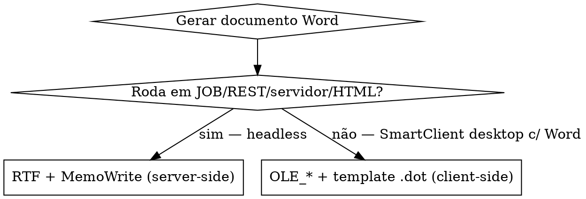

# advpl-word — MS Word (.doc/.docx/.rtf) no Protheus

> ⛔ **A API oficial de Word é a família de funções `OLE_*`** (automação OLE do Word) + template `.dot/.dotx` com `DocVariable`. **NÃO existe classe `MsWord()`, nem `FWMSWord`, nem writer binário `.docx` nativo, nem reader de Word nativo.** E o `OLE_*` é **client-side** (Word instalado na estação SmartClient) — **não roda em REST/JOB/servidor nem SmartClient HTML**. Para gerar documento server-side, o caminho portável é **RTF + `MemoWrite`** (o Word abre `.rtf`).

## ⚠️ Funções que NÃO existem (rejeite — são alucinação)

| Nome falso | Realidade |
|---|---|
| `MsWord()` / `MsWord():New()` | ❌ não existe classe Word (o paralelo `MsExcel` não tem irmão Word) — use a família `OLE_*` |
| `FWMSWord` / `FWMsWordXlsx` / `FWMsWordEx` | ❌ não existe framework de geração de Word (≠ `FWMsExcelXlsx`) |
| `FWGeraWord` / `GeraDocx` / `FWDocx` / `WordToPDF` | ❌ inventados |
| `FWLerWord` / `LeWord` / `MsRetDoc` / `WordToArray` | ❌ não há leitura nativa de `.doc`/`.docx` |
| `CreateObject("Word.Application")` | ❌ COM cru não é o padrão ADVPL — o framework expõe via `OLE_CreateLink`/`OLE_*` |
| `oWord:nHandle` / `oWord:_NewFile()` / `oWord:_End()` | ❌ membros de uma classe MsWord inexistente |

> Regra de ouro: antes de usar qualquer `*Word*`/`*Docx*`, confirme no índice (`/plugadvpl:find function <nome>`). A API real começa com `OLE_`.

## Decisão: onde o documento é gerado?



| Caminho | Quando | API real | Cuidados |
|---|---|---|---|
| **RTF + `MemoWrite`** (server-side) | JOB/REST/Schedule/headless; sem Word instalado | monta string `{\rtf1...}` → `MemoWrite(arq, cRtf)` (ou `FWFileWriter`) | Word/LibreOffice abrem `.rtf`; portável; é DIY (você monta o RTF) |
| **`OLE_*` + template `.dot/.dotx`** | tela interativa (SmartClient desktop), Word instalado | `OLE_CreateLink` → `OLE_NewFile(tmpl)` → `OLE_SetDocumentVar` → `OLE_UpdateFields` → `OLE_SaveAsFile`/`OLE_PrintFile` → `OLE_CloseFile`/`OLE_CloseLink` | **NÃO roda server-side/JOB/REST/HTML** (`ApOleClient` indisponível no HTML) |
| **`.docx` = ZIP de XML** (avançado) | precisa `.docx` real server-side | `FUnzip`/`FZip` + `TXmlManager` no `document.xml` | DIY, sem helper publicado; trabalhoso |

## OLE_* — preencher template `.dot/.dotx` (client-side, oficial)

Mala direta oficial: cria-se um modelo Word com campos **DocVariable** (Inserir → Partes Rápidas → Campo → DocVariable) e preenche-se cada variável do ADVPL.

```advpl
#include "totvs.ch"

User Function ZWrCart()
    Local nWord  := 0
    Local cTmpl  := "C:\dots\carta.dotx"          // template na ESTAÇÃO (Word instalado)
    Local cSaida := GetTempPath() + "carta.docx"

    BeginMsOle()                                  // envolve o bloco OLE
        nWord := OLE_CreateLink()                 // abre link com o Word (client-side)
        If ValType(nWord) == "N" .And. nWord > 0
            OLE_SetProperty(nWord, OLEWDVISIBLE, .F.)
            OLE_NewFile(nWord, cTmpl)             // novo doc a partir do template
            OLE_SetDocumentVar(nWord, "NomeCli", "ABC Comercio LTDA")  // = DocVariable
            OLE_SetDocumentVar(nWord, "CnpjCli", "12.345.678/0001-90")
            OLE_SetDocumentVar(nWord, "DataDoc", DToC(Date()))
            OLE_UpdateFields(nWord)               // aplica as variáveis nos campos
            OLE_SaveAsFile(nWord, cSaida)         // salva .docx (ou nFormato=17 p/ PDF)
            // OLE_PrintFile(nWord, "ALL", , , 1) // imprimir, se quiser
            OLE_CloseFile(nWord)
            OLE_CloseLink(nWord)
        EndIf
    EndMsOle()
Return Nil
```

| Função | Para que serve |
|---|---|
| `OLE_CreateLink([cVersao])` | Abre o link OLE com o Word; retorna handle numérico (`-1`/`<=0` = falhou) |
| `OLE_NewFile(h, cDotPath)` | Cria documento a partir do template `.dot/.dotx` |
| `OLE_OpenFile(h, cArq [,lRO,...])` | Abre documento existente (`.doc/.docx/.dot`) |
| `OLE_SetDocumentVar(h, cVar, cVal)` | Preenche um `DocVariable` do template |
| `OLE_GetDocumentVar(h, cVar)` | Lê um `DocVariable` |
| `OLE_UpdateFields(h)` | Aplica as variáveis nos campos (chamar após os `SetDocumentVar`) |
| `OLE_ExecuteMacro(h, cMacro)` | Roda macro VBA (`.bas`) do template — usado p/ tabelas dinâmicas |
| `OLE_SetProperty(h, nProp, x)` | Propriedade (ex.: `OLEWDVISIBLE`) |
| `OLE_SaveFile(h)` / `OLE_SaveAsFile(h, cArq [,...,nFmt])` | Salva; `nFmt=17` = PDF (`wdFormatPDF`) |
| `OLE_PrintFile(h, "ALL", nIni, nFim, nCopias)` | Imprime |
| `OLE_CloseFile(h)` / `OLE_CloseLink(h)` | Fecha doc / fecha link com o Word |
| `BeginMsOle()` / `EndMsOle()` | Envolvem o bloco OLE |

**Parâmetros `MV_*` da integração padrão (FAT0081/GPEWORD):** `MV_PATWORD` (pasta dos `.dot` na estação), `MV_PATTERM` (saída), `MV_DOCAR` (`.dot` no servidor), `MV_NOMEDOT`. **Mover arquivo server↔client:** `CPYS2T()` (server→client), `CPYT2S()` (client→server). Existe rotina padrão TOTVS de mala direta no RH: **GPEWORD**.

## RTF — geração server-side (JOB/REST/headless, sem Word)

`.rtf` é texto puro que o Word abre. Monte a string RTF e grave com `MemoWrite`/`FWFileWriter` — roda no AppServer, sem OLE, sem Word instalado.

```advpl
#include "totvs.ch"

User Function ZWrRtf(cNome, cCnpj, cArq)
    Local cRtf := ""
    Default cNome := "ABC Comercio LTDA"
    Default cCnpj := "12.345.678/0001-90"
    Default cArq  := "\docs\carta.rtf"

    cRtf := "{\rtf1\ansi\deff0 {\fonttbl{\f0 Arial;}}" + CRLF        // \ansi = cp1252
    cRtf += "\fs28\b CARTA AO CLIENTE\b0\par\par" + CRLF             // \fs = meio-ponto (28=14pt); \b/\b0 negrito
    cRtf += "\fs20 Razao Social: " + cNome + "\par" + CRLF          // \par = nova linha
    cRtf += "CNPJ: " + cCnpj + "\par\par" + CRLF
    cRtf += "Sao Paulo, " + DToC(Date()) + ".\par" + CRLF
    cRtf += "}"

    MemoWrite(cArq, cRtf)                                            // grava no servidor (RootPath-relativo)
Return Nil
```

> RTF essencial: `\rtf1\ansi` (cp1252) · `\fonttbl` (fontes) · `\fsN` (tamanho em meio-ponto: 24=12pt) · `\b`/`\b0` (negrito on/off) · `\i`/`\i0` (itálico) · `\par` (parágrafo) · `\qc`/`\ql`/`\qj` (centro/esq/justif). Escape de `\`, `{`, `}` no texto → `\\`, `\{`, `\}`; acentos cp1252 → `\'e9` (hex) se precisar portabilidade total.

## Leitura de Word — não há função nativa

Igual ao Excel: **sem leitor nativo** de `.doc/.docx`. Opções: abrir via `OLE_OpenFile` (client-side, Word instalado) ou, como `.docx` é ZIP de XML, descompactar (`FUnzip`) e parsear `word/document.xml` com `TXmlManager`. Para só trazer o arquivo do server à estação: `cGetFile()` + `CpyS2T`.

## TLPP

Sem namespace/annotation de office — **as mesmas funções `OLE_*` e o caminho RTF** valem em `.tlpp` e `.prw`. Veja `[[advpl-tlpp]]`. Em JOB/RPC/REST TLPP, OLE Word não roda → use RTF.

## Anti-padrões

- Inventar `MsWord()`/`FWMSWord`/`FWGeraWord`/`CreateObject("Word.Application")` (tabela do topo) — não existem como API de framework.
- `OLE_*` (Word) em **JOB/REST/Schedule/servidor/SmartClient HTML** → `ApOleClient` indisponível; falha. Use RTF. Veja `[[advpl-jobs-rpc]]`.
- Esquecer `OLE_UpdateFields` após `OLE_SetDocumentVar` → variáveis não aplicam no documento.
- Não fechar com `OLE_CloseFile`/`OLE_CloseLink` (dentro de `BeginMsOle/EndMsOle`) → `WINWORD.EXE` preso em memória na estação.
- Esperar `.docx` binário "montado em ADVPL" sem OLE/sem template → não existe; server-side use RTF (ou unzip+XML manual).
- `{{marcador}}` / regex no template → o padrão Word é **DocVariable**, não placeholder textual.

## Comandos plugadvpl relacionados

- `/plugadvpl:find function OLE_CreateLink` — confirma uso real de OLE Word no projeto.
- `/plugadvpl:grep "OLE_SetDocumentVar|OLE_NewFile|MemoWrite"` — acha geração de Word/RTF no codebase.
- `/plugadvpl:lint <arq>` — RecLock/Transaction etc. na rotina.

## Cross-references

- `[[advpl-excel]]` — Excel: `MsExcel()` OLE (client) e `FWMsExcelXlsx` (server). Word **não** tem equivalente server-side de geração binária — só RTF.
- `[[advpl-jobs-rpc]]` — por que OLE não roda em JOB/REST (sem app externo no servidor).
- `[[advpl-tlpp]]` — mesmas funções em `.tlpp`.
- `[[advpl-ui-patterns]]` — fluxo interativo no SmartClient.
- `[[advpl-fundamentals]]` — funções restritas/nativas, naming.

## Exemplos práticos

Em [`exemplos/`](exemplos/) (genéricos, UTF-8):

- `gerar_rtf_servidor.prw` — geração **server-side** (JOB/REST): monta RTF + `MemoWrite`, sem Word instalado.
- `word_ole_template.prw` — geração **client-side**: `OLE_*` preenchendo template `.dot/.dotx` via `DocVariable`.

## Sources (verificadas na pesquisa)

- [CDA 360022751891 — Integração com o Word + cópias de arquivo (lista das funções OLE_*)](https://centraldeatendimento.totvs.com/hc/pt-br/articles/360022751891) **(fonte-chave)**
- [CDA 115011738188 — Integração Protheus x MS Word (template .dot + macro)](https://centraldeatendimento.totvs.com/hc/pt-br/articles/115011738188)
- [TDN 272155768 — ADV0001_INT (exemplo completo OLE_*)](https://tdn.totvs.com/pages/viewpage.action?pageId=272155768) · [TDN OLE_SaveAsFile](https://tdn.totvs.com/display/PROT/OLE_SaveAsFile)
- [TDN 239035266 — FAT0081 (MV_PATWORD/MV_PATTERM/MV_DOCAR/MV_NOMEDOT)](https://tdn.totvs.com/pages/viewpage.action?pageId=239035266) · [CDA 360021565472 — GPEWORD (.dot/.dotx → PDF)](https://centraldeatendimento.totvs.com/hc/pt-br/articles/360021565472)
- [TDN 544205062 — ApOleClient indisponível no SmartClient HTML](https://tdn.totvs.com/pages/viewpage.action?pageId=544205062) · [CDA 360016461772 — recursos internos sem suporte](https://centraldeatendimento.totvs.com/hc/pt-br/articles/360016461772)
- [Terminal de Informação — Integração Word via OLE_ (Maratona 374)](https://terminaldeinformacao.com/2024/04/24/integracao-com-o-word-atraves-das-funcoes-ole_-maratona-advpl-e-tl-374/) · [Word→PDF via OLE_](https://terminaldeinformacao.com/2023/07/05/como-gerar-um-pdf-de-um-word-via-advpl/) · [MemoWrite](https://terminaldeinformacao.com/2024/04/09/criando-arquivos-com-a-memowrite-maratona-advpl-e-tl-345/)
- [siga0984 — OLE/app externo não roda em JOB server-side](https://siga0984.wordpress.com/2018/09/09/executando-jobs-em-advpl/)
